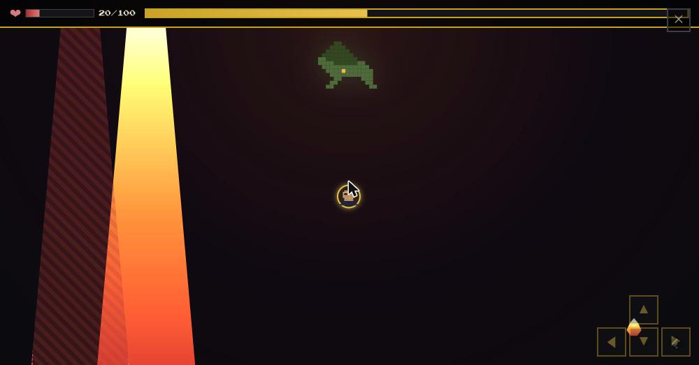
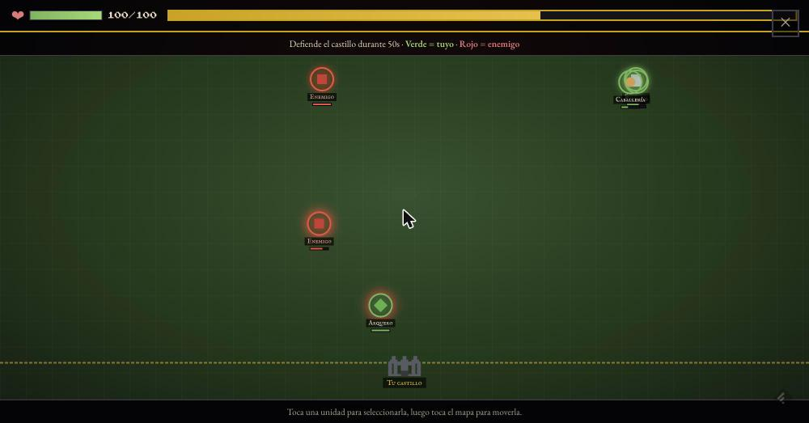
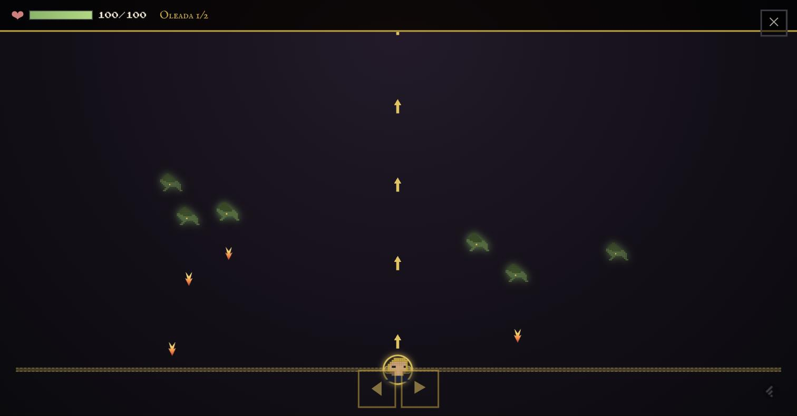
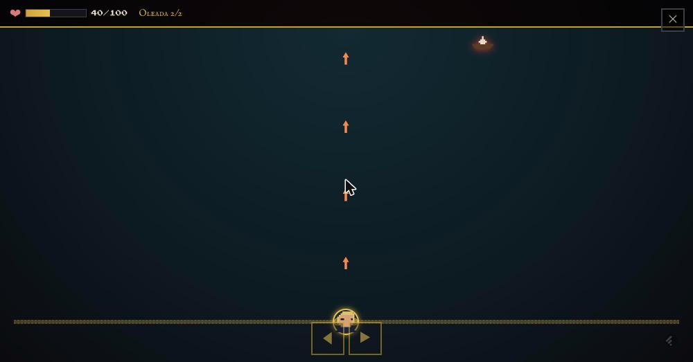
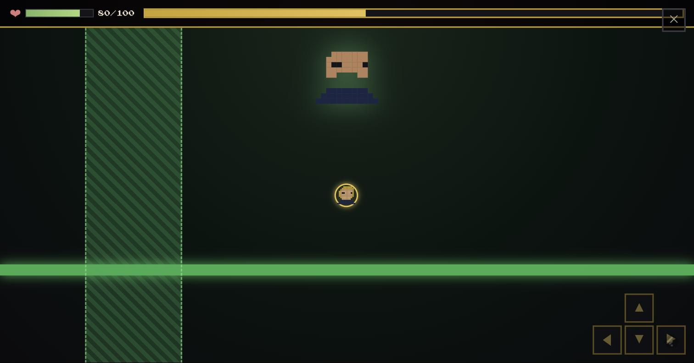
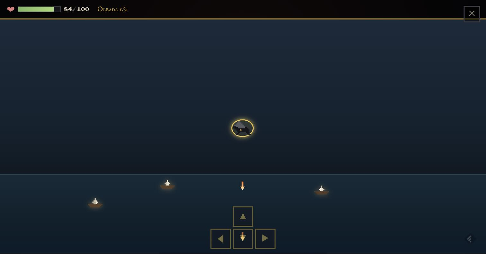
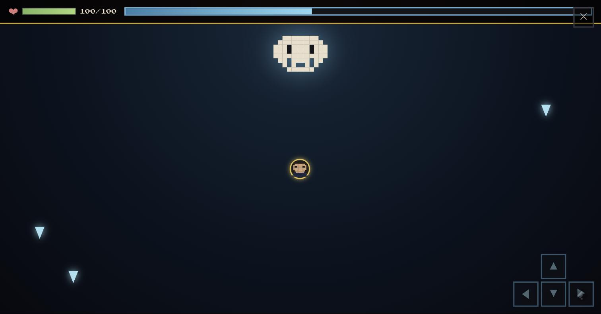

# Crónica de Poniente

**Aventura narrativa en pixel art 16-bit sobre la historia de Poniente**, desde el reinado de Viserys I Targaryen (*La Casa del Dragón*) hasta la Larga Noche de *Juego de Tronos* — **historia completa, de principio a fin**: 7 capítulos, 25 acontecimientos y 7 jefes finales, cada uno con su propio minijuego de acción.

🎮 **Juega ahora:** [house-of-dragons-beryl.vercel.app](https://house-of-dragons-beryl.vercel.app)

<p align="center">
  
</p>

## Qué es esto

No es un RPG de combate ni un simulador de estrategia: eres un **viajero cronista** que recorre Poniente para presenciar de cerca los grandes acontecimientos de su historia. No cambias el destino de reyes ni dragones — eres testigo de él, lo registras en tu propia crónica, y aprendes de cada suceso.

El bucle de juego es siempre el mismo:

**Explorar el mapa → entrar en un acontecimiento histórico → leer la narración y los diálogos → tomar una decisión → responder una pregunta → recibir recompensa → desbloquear el siguiente acontecimiento.**

Cada dato histórico incluye año, localización y personajes implicados, e indica explícitamente cuándo una escena procede de la serie de televisión y difiere de la novela en la que se basa (nunca se presenta como un hecho lo que en realidad es una teoría de fans o una licencia dramática).

Al final de cada capítulo espera un **jefe final**: un combate en tiempo real, distinto en cada capítulo, contra la amenaza que define ese momento de la historia — el dragón de Vhagar, el Rey Loco, el Rey de la Noche...

## Los 7 capítulos

| # | Capítulo | Época | Jefe final | Minijuego |
|---|---|---|---|---|
| 1 | La Danza de los Dragones | 129–131 d.C. | Vhagar Desatada | Esquiva aérea de ataques de dragón (fuego, rayo, ráfagas laterales) |
| 2 | Las Cenizas | 131–153 d.C. (aprox.) | Las Fronteras en Llamas | Táctica en tiempo real: mueve tropas para defender el castillo |
| 3 | Los Targaryen | 153–282 d.C. (aprox.) | El Dragón de Harren el Negro | Tirador de flechas por oleadas contra un dragón fantasma |
| 4 | La Rebelión | 282–283 d.C. (aprox.) | El Rey Loco | Huida en 2D esquivando pólvora líquida por Desembarco del Rey |
| 5 | El Juego de Tronos | 298–299 d.C. | La Flota de Stannis | Batalla naval: hunde la flota antes de que llegue a las murallas |
| 6 | La Madre de Dragones | 298–300 d.C. (aprox.) | La Flota Esclavista | Vuelo libre en 2D a lomos de Drogon contra un buque insignia |
| 7 | El Invierno | 300 d.C. (aprox.) | El Rey de la Noche | Supervivencia en el bosque de dioses de Invernalia |

## Capturas

| Creación de personaje | Mapa de Poniente |
|---|---|
|  |  |

| Diálogos estilo RPG | Decisiones con consecuencias narrativas |
|---|---|
|  |  |

| Recompensas y logros | Cronología interactiva |
|---|---|
|  |  |

<p align="center">
  
</p>

## Los jefes en acción

Cada uno de los 7 jefes de capítulo es un minijuego de acción distinto, con su propia mecánica, música y controles (arrastrar el dedo, botones en pantalla o ambos):

| Vhagar Desatada (cap. 1) — esquiva aérea | Las Fronteras en Llamas (cap. 2) — táctica en tiempo real |
|---|---|
|  |  |

| El Dragón de Harren el Negro (cap. 3) — dragoncillos y huevos que eclosionan | La Flota de Stannis (cap. 5) — batalla naval |
|---|---|
|  |  |

| El Rey Loco (cap. 4) — huida esquivando pólvora líquida | La Flota Esclavista (cap. 6) — vuelo libre a lomos de Drogon |
|---|---|
|  |  |

<p align="center">
  
  <br /><sub>El Rey de la Noche (capítulo 7) — supervivencia en el bosque de dioses de Invernalia</sub>
</p>

## Contenido de esta versión

Esta es la **historia completa, de principio a fin**, no una demo ni un prototipo a medias:

- **Menú y creación de personaje**: nombre y vocación (Guerrero, Explorador o Cronista), con una animación de dragón volando en pixel art y un tema musical 8-bit propio.
- **Mapa de Poniente**: 9 localizaciones (Rocadragón, Desembarco del Rey, Harrenhal, Invernalia, Bastión de Tormentas, Antigua, El Valle, Pyke y Más Allá del Muro), desbloqueadas progresivamente a medida que avanza la historia. Varias comparten localización entre capítulos distintos sin mezclar el contenido de uno con el otro.
- **7 capítulos completos, 25 acontecimientos jugables**: desde la muerte de Viserys I hasta la batalla de Invernalia, cada uno con narración, diálogos, una decisión que cambia el texto que se muestra y una pregunta de historia con corrección inmediata (fallar nunca bloquea la partida — solo resta vida del intento en curso).
- **7 jefes finales, 7 minijuegos de acción distintos** (uno por capítulo, ver tabla arriba): esquiva aérea, táctica en tiempo real, tirador por oleadas, huida en 2D, batalla naval, vuelo libre y supervivencia. Varios permiten elegir con qué personaje jugarlos (Rhaenyra/Daemon/Aemond, un Lannister, un arquero, un defensor de Invernalia...). Cada jefe telegrafía sus ataques antes de golpear y tiene tres niveles de dificultad (Fácil/Normal/Difícil).
- **Controles pensados para móvil de verdad**: en los tiradores (arquero, batalla naval, vuelo de Drogon) el disparo es automático — el único gesto que necesitas es moverte, arrastrando el dedo por un carril visible estilo Arkanoid o con los botones en pantalla. Los proyectiles, tanto tuyos como enemigos, tienen forma real de flecha, no simples cuadrados.
- **Banda sonora original por jefe**: cada uno de los 7 jefes tiene su propio tema musical generado en el momento (distinto modo, tempo e instrumentación según el tono del combate), además del tema principal del menú — todo sintetizado, sin un solo archivo de audio externo.
- **Cronología**: línea temporal vertical con los 7 capítulos, sus acontecimientos y sus jefes.
- **Enciclopedia de Poniente**: Personajes, Casas, Dragones, Lugares y Sucesos, con retratos en pixel art propios que se desbloquean según lo que hayas descubierto jugando.
- **Logros**: Primer Viaje, Cronista (10 acontecimientos completados), Conocedor de Poniente (10 respuestas correctas), Fuego y Sangre (capítulo 1 completo) y El Invierno (llegar al capítulo final).
- **Guardado automático** en `localStorage`, con protección explícita contra farmeo de progreso: repetir un acontecimiento ya completado (por curiosidad, o al reintentar tras morir) nunca vuelve a dar conocimiento/experiencia ni desordena tu punto de avance real.
- **PWA instalable**: en Ajustes hay un botón "Instalar como App" para añadirlo a la pantalla de inicio en Android; en iPhone se instala desde el menú compartir de Safari.

La arquitectura de datos (`src/data/`) separa personajes, dragones, casas, localizaciones, capítulos, eventos, jefes y logros del código de los componentes — cada minijuego de jefe vive en `src/components/minigames/` como una unidad autocontenida con su propio bucle de juego.

## Tecnología

- React + TypeScript + Vite
- CSS puro (sin frameworks de UI) — pixel art dibujado con `box-shadow`, sin ninguna imagen externa
- `localStorage` para el guardado — sin backend, sin base de datos
- Web Audio API para música y efectos — sin archivos `.mp3`/`.wav`; un motor de temas propio (`src/utils/audio.ts`) sintetiza en tiempo real el tema del menú y un tema distinto para cada uno de los 7 jefes
- `vite-plugin-pwa` para el manifest y el service worker

## Desarrollo local

```bash
yarn install
yarn dev
```

## Build de producción

```bash
yarn build
yarn preview
```

## Regenerar los iconos de la PWA

```bash
yarn generate-icons
```
