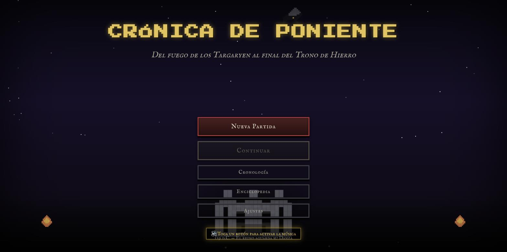
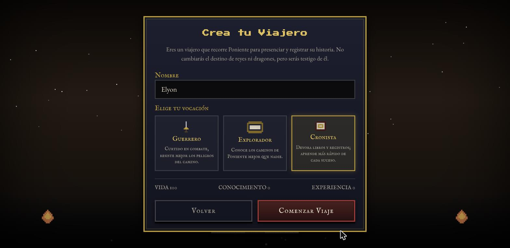
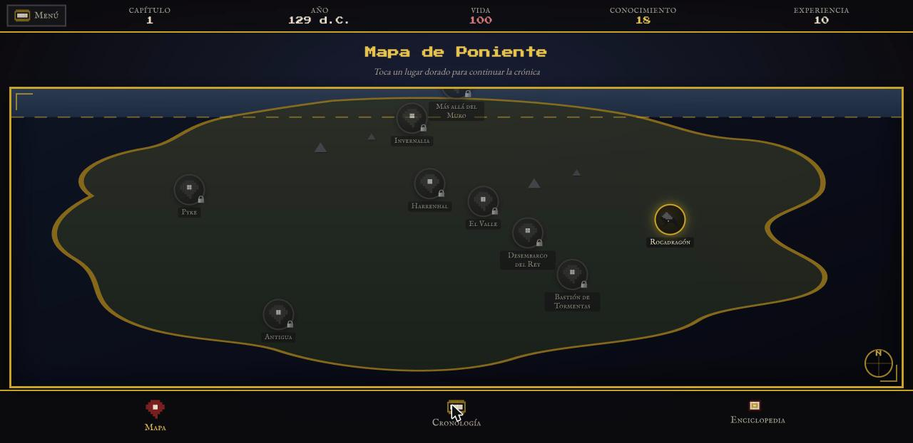
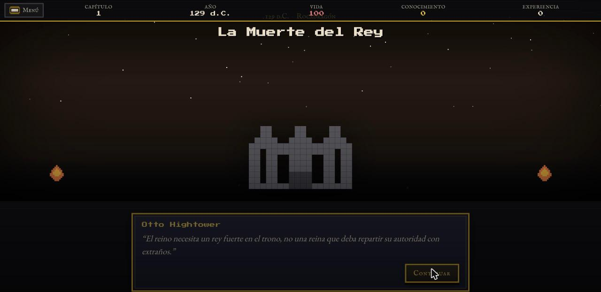
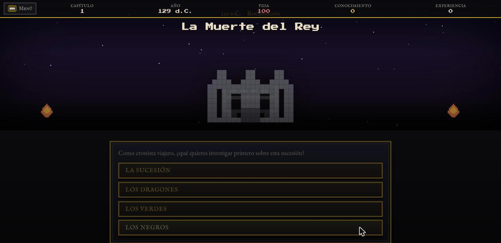
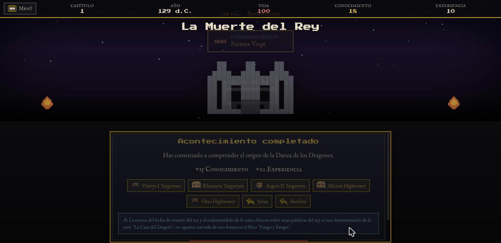
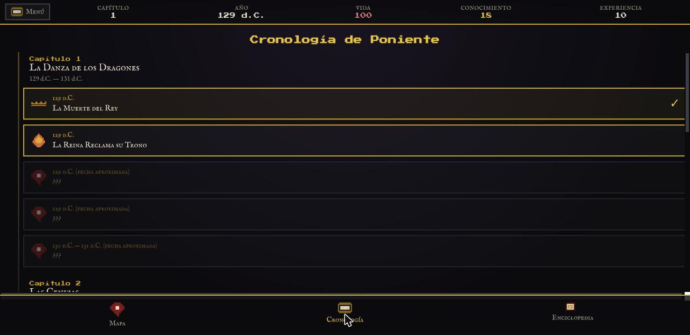
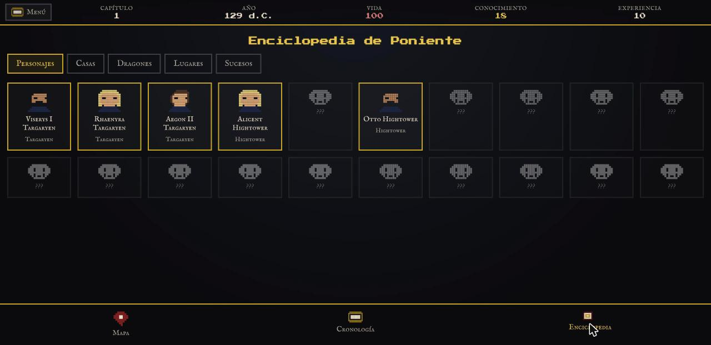

# Crónica de Poniente

**Aventura narrativa en pixel art 16-bit sobre la historia de Poniente**, desde el reinado de Viserys I Targaryen (*La Casa del Dragón*) hasta el final de *Juego de Tronos*.

🎮 **Juega ahora:** [house-of-dragons-beryl.vercel.app](https://house-of-dragons-beryl.vercel.app)

<p align="center">
  
</p>

## Qué es esto

No es un RPG de combate ni un simulador de estrategia: eres un **viajero cronista** que recorre Poniente para presenciar de cerca los grandes acontecimientos de su historia. No cambias el destino de reyes ni dragones — eres testigo de él, lo registras en tu propia crónica, y aprendes de cada suceso.

El bucle de juego es siempre el mismo:

**Explorar el mapa → entrar en un acontecimiento histórico → leer la narración y los diálogos → tomar una decisión → responder una pregunta → recibir recompensa → desbloquear el siguiente acontecimiento.**

Cada dato histórico incluye año, localización y personajes implicados, e indica explícitamente cuándo una escena procede de la serie de televisión y difiere de la novela en la que se basa (nunca se presenta como un hecho lo que en realidad es una teoría de fans o una licencia dramática).

## Capturas

| Creación de personaje | Mapa de Poniente |
|---|---|
|  |  |

| Diálogos estilo RPG | Decisiones con consecuencias narrativas |
|---|---|
|  |  |

| Recompensas y logros | Cronología interactiva |
|---|---|
|  |  |

<p align="center">
  
</p>

## Contenido de esta versión

Esta es una **vertical slice completa y jugable de principio a fin**, no una demo ni un prototipo a medias:

- **Menú y creación de personaje**: nombre y vocación (Guerrero, Explorador o Cronista).
- **Mapa de Poniente**: 9 localizaciones, desbloqueadas progresivamente a medida que avanza la historia.
- **Capítulo 1 completo — "La Danza de los Dragones"**: 5 acontecimientos jugables desde la muerte de Viserys I hasta el fin de la guerra civil Targaryen, cada uno con narración, diálogos, una decisión que cambia el texto que se muestra y una pregunta de historia con corrección inmediata (fallar nunca bloquea la partida).
- **Cronología**: línea temporal vertical con los 7 capítulos previstos; los acontecimientos futuros aparecen como próxima entrega, nunca como botones falsos.
- **Enciclopedia de Poniente**: Personajes, Casas, Dragones, Lugares y Sucesos, con retratos en pixel art propios que se desbloquean según lo que hayas descubierto jugando.
- **Logros**: Primer Viaje, Cronista, Conocedor de Poniente, Fuego y Sangre, El Invierno.
- **Guardado automático** en `localStorage`: cierra el navegador y "Continuar" te devuelve exactamente donde lo dejaste.
- **Audio retro en 8-bit** compuesto para el juego (tema del menú, efectos de clic, aciertos/fallos, logros) generado con la Web Audio API — cero archivos de sonido externos.
- **PWA instalable**: en Ajustes hay un botón "Instalar como App" para añadirlo a la pantalla de inicio en Android; en iPhone se instala desde el menú compartir de Safari.

La arquitectura de datos (`src/data/`) separa personajes, dragones, casas, localizaciones, capítulos, eventos y logros del código de los componentes, precisamente para poder añadir los capítulos 2 a 7 (hasta llegar a *Juego de Tronos*) sin tocar la interfaz.

## Tecnología

- React + TypeScript + Vite
- CSS puro (sin frameworks de UI) — pixel art dibujado con `box-shadow`, sin ninguna imagen externa
- `localStorage` para el guardado — sin backend, sin base de datos
- Web Audio API para música y efectos — sin archivos `.mp3`/`.wav`
- `vite-plugin-pwa` para el manifest y el service worker

## Desarrollo local

```bash
yarn install
yarn dev
```

## Build de producción

```bash
yarn build
yarn preview
```

## Regenerar los iconos de la PWA

```bash
yarn generate-icons
```
